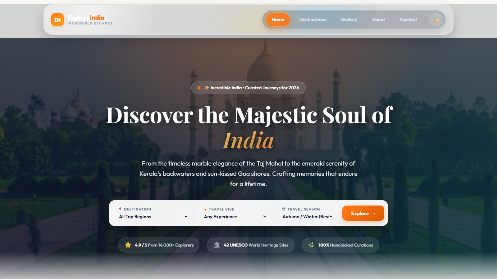
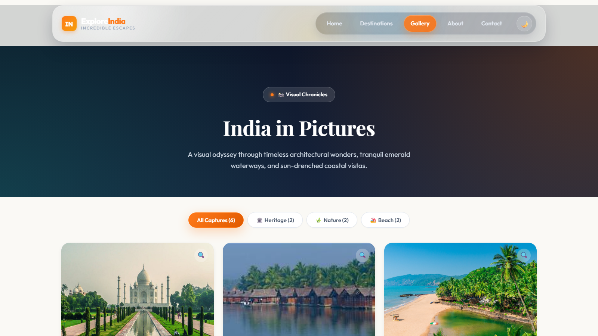
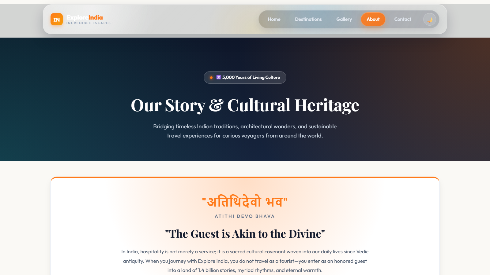
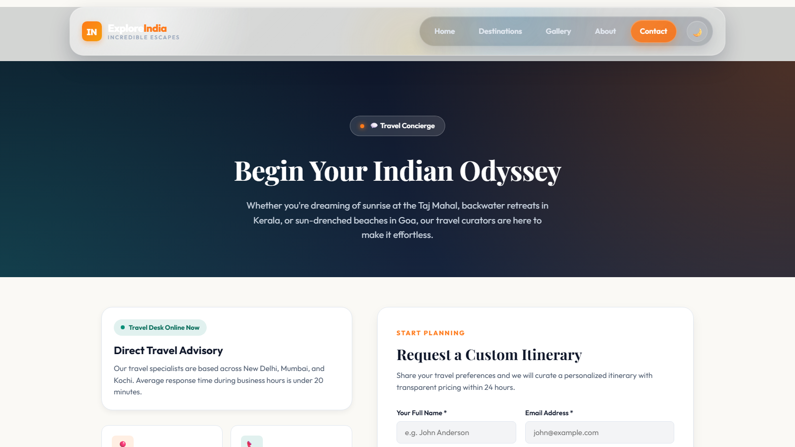

# Explore India

Explore India is a responsive travel website that showcases curated journeys through India's heritage sites, backwaters, beaches, and cultural destinations. It is also a lightweight static project for practising DevOps workflows, CI/CD automation, and deployment.

## Pages

- **Home** - Hero search, destination filters, featured journeys, and travel highlights
- **Gallery** - Filterable destination photography with a lightbox viewer
- **About** - Cultural heritage, mission, travel pillars, and milestones
- **Contact** - Concierge information, FAQ accordion, and custom itinerary form

## Features

- Responsive layout for desktop and mobile screens
- Light and dark theme toggle with `localStorage` persistence
- Mobile navigation menu
- Destination and gallery category filters
- Image lightbox with keyboard and overlay dismissal
- Animated counters, fade-in sections, and scroll-to-top control
- Contact form and FAQ interactions

## Screenshots

### Home



### Gallery



### About



### Contact



## Project Structure

```text
.
|-- index.html
|-- gallery.html
|-- about.html
|-- contact.html
|-- css/
|   `-- style.css
|-- scripts/
|   `-- script.js
|-- images/
`-- screenshots/
```

## Run Locally

This project has no build step or external package dependencies. Open `index.html` directly in a browser, or serve the folder with any static web server:

```bash
python -m http.server 8000
```

Then visit <http://localhost:8000>.

## DevOps Practice Goals

- Use the static site as a small CI/CD pipeline exercise
- Add automated HTML, CSS, and JavaScript checks
- Practise version control, build validation, and deployment automation
- Track workflow improvements as the project evolves
